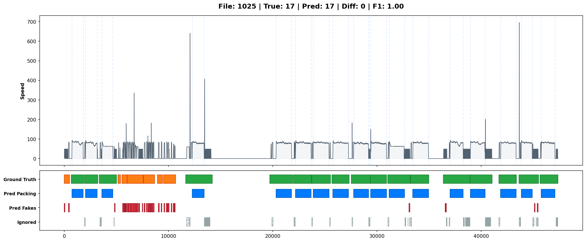

# Детекция и подсчет циклов упаковки

Проект реализует **End-to-End ML пайплайн** для анализа временных рядов скорости упаковочного станка. Основная задача — точный подсчет количества успешных упаковок (`Successful Packing`) и фильтрация ложных срабатываний (фейковых запусков и застреваний).

## Постановка задачи и Данные

Входные данные представляют собой временной ряд скорости станка (`Speed_2`).
Целевая переменная формируется на основе ручной разметки (Label Studio):

1.  **1_Successful_Packing** (Целевой класс, ID: 1) — полноценный цикл упаковки.
2. **3_Fake_Launch** (Негативный класс, ID: 2) — сбои или холостые прогоны. Используются для обучения модели отличать "похожие на правду" паттерны от реальных.
3.  **Noise** (Фон, ID: 0) — простой станка.
4.  **2_Struggling_Process** Был раньше в разметке, но каждый процесс разделили на sucessful часть и fake

**Особенность:** Это не просто задача классификации ("какой класс в точке t"), а задача **Event Detection**. Нам важно количество событий, а не accuracy по точкам.

---

## Техническое решение

Решение состоит из двух этапов: **Сэмпловая классификация** и **Эвристический постпроцессинг**.

### 1. Генерация признаков (Feature Engineering)
Используются скользящие окна (Rolling Windows) разных размеров $w \in [10, 30, 100, 300, 500, 1000]$.

Для каждого окна считаются статистики:
*   **Mean:** $\mu_w = \frac{1}{w} \sum_{i} x_i$
*   **Max:** $max_w = \max(x_i)$
*   **Std:** $\sigma_w = \sqrt{\frac{1}{w} \sum (x_i - \mu)^2}$
*   **Zero Ratio:** Доля нулевых значений (простоев) в окне.
*   **Lag:** Значение скорости со смещением (lag 50).

### 2. Модель
Используется **Random Forest Classifier** (`class_weight='balanced'`).
*   Он устойчив к выбросам.
*   Хорошо работает с табличными фичами временных рядов.
*   Предоставляет `feature_importance` для интерпретации.

### 3. Smart Event Counter (Постпроцессинг)
Сырые вероятности модели ($P(Success) > Threshold$) превращаются в события с помощью физических ограничений:

1.  **Hard Stop Segmentation:** Используется сигнал сырой скорости. Если $Speed \le 2$ в течение $N$ тактов — это физическая остановка машины. Она принудительно разрывает склеенные события.
2.  **Duration Constraints:** Из обучающей выборки рассчитывается **1-й перцентиль** длительности успешных упаковок (автоматический расчет `MIN_PACKING_LIMIT`). Все предсказания короче этого порога отбрасываются как шум.
3.  **Gap Tolerance:** Допуск на краткосрочные просадки вероятности внутри одного события.

---

## Запуск проекта

Весь проект упакован в Docker для воспроизводимости.

### 1. Сборка и запуск контейнера

```bash
# 1. Сборка образа (установит все зависимости из requirements.txt)
./build

./launch_container

# 3. Вход в контейнер 
docker exec -it <container_name> /bin/bash
```

### 2. Запуск пайплайна обучения (Script)

Внутри контейнера:
```bash
python scripts/train.py
```
*   Загружает данные из `data/raw`.
*   Считает статистику и лимиты.
*   Запускает GridSearch.
*   Подбирает лучший Probability Threshold.
*   Сохраняет модель в `models/`.
*   Сохраняет графики и метрики в `outputs/`.

### 3. Работа с Notebooks
Если нужны эксперименты (EDA):
```bash
# Ссылка на Jupyter появится в консоли при старте контейнера
# Откройте notebooks/run.ipynb
```
*Ноутбук настроен так, чтобы сохранять результаты локально в папку `notebooks/results`, не засоряя основной проект.*

---

## Конфигурация (`configs/config.yaml`)

Все гиперпараметры вынесены в конфиг. Не нужно править код, чтобы изменить эксперимент.

```yaml
data:
  window_sizes: [10, 30, 100, 300, 500, 1000] # Размеры окон для фичей

model:
  grid_search: # Параметры для перебора
    n_estimators: [100]
    max_depth: [15, 25]

postprocessing:
  min_packing_limit_percentile: 1    # Отсечение по длительности (1% самых коротких)
  prob_threshold_search_range: [0.35, 0.70, 0.05] # Диапазон поиска порога
  default_gap_tolerance: 5           # Допуск на разрывы в сигнале
```

---

## Результаты

### Пример детекции
Визуализация показывает:
*   **Зеленый:** Истинная разметка (Ground Truth).
*   **Синий:** Предсказание модели (Prediction).
*   **Красный:** Фейковые запуску (игнорируются).
*   **Заштрихованный серый:** Слишком короткие события (отфильтрованный шум).


*(Пример: Файл 1025.txt, модель корректно нашла 18 событий, отфильтровав шум)*

### Метрики (пример)
Таблица сохраняется в `outputs/final_metrics.csv`.

| File | True (GT) | Pred | Diff | Precision | Recall | F1 |
| :--- | :--- | :--- | :--- | :--- | :--- | :--- |
| 1025 | 18 | 18 | 0 | 1.00 | 1.00 | 1.00 |
| 1029 | 15 | 14 | -1 | 1.00 | 0.93 | 0.96 |
| 1102 | 22 | 23 | +1 | 0.95 | 1.00 | 0.97 |

**Total MAE (Mean Absolute Error):** Абсолютная разница в количестве событий по всему датасету.

---

Для интеграции **Label Studio** в ваш проект нам нужно: обновить зависимости, открыть новый порт в Docker, разрешить работу с локальными файлами (Local Storage) и добавить инструкцию в README.


## Разметка данных в Label Studio

Для разметки новых данных используется Label Studio, интегрированная в контейнер.

### Запуск
Label Studio запускается автоматически вместе с контейнером на порту `8081`. 
Если нужно запустить вручную внутри контейнера: `label-studio start --port 8081`

### Настройка проекта
1. Откройте в браузере: `http://<ваш_ip_сервера>:8081`
2. Создайте проект (например, "Packing_Labeling").
3. В **Settings -> Labeling Interface** выберите **Browse Templates -> Time Series Analysis** и вставьте следующий XML-код (Template):

```xml
<View>
  <Header value="Разметка: 1-Успех, 2-Проблема, 3-Фейк"/>
  <TimeSeries name="ts" value="$csv" valueType="url" sep="," timeColumn="time">
    <Channel column="speed" strokeColor="#1f77b4" />
  </TimeSeries>

  <TimeSeriesLabels name="label" toName="ts">
    <Label value="1_Successful_Packing" background="#28a745" hotkey="1"/>
    <Label value="2_Struggling_Process" background="#ffc107" hotkey="2"/>
    <Label value="3_Fake_Launch" background="#dc3545" hotkey="3"/>
    <Label value="Noise" background="#cccccc" hotkey="4"/>
  </TimeSeriesLabels>
</View>
```

### Подключение данных (Local Storage)
Так как данные лежат в `./data/label_studio_data/`, мы подключили их как локальное хранилище:
1. Перейдите в **Settings -> Cloud Storage -> Add Source Storage**.
2. Storage Type: **Local Files**.
3. Absolute local path: `/app/data/label_studio_data/`.
4. Включите **Treat every bucket object as a source file**.
5. Нажмите **Add Storage**, затем **Sync**. Ваши CSV файлы появятся в списке задач.

---

## Future Work

В разработке находится скрипт `scripts/predict.py`.
Он позволит прогонять модель на новых `.txt` файлах без разметки:

```bash
# План использования (Coming Soon)
python scripts/predict.py --input data/new_series/ --model models/best_rf_model.joblib
```

